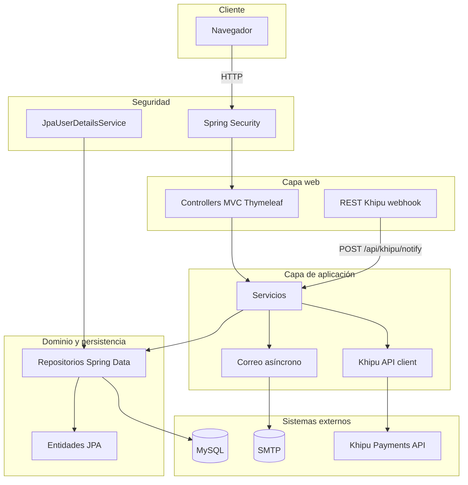
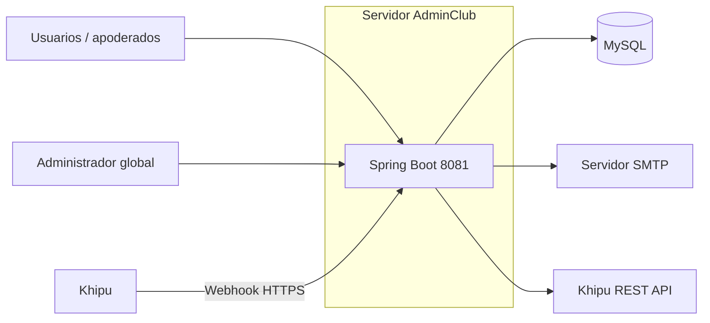
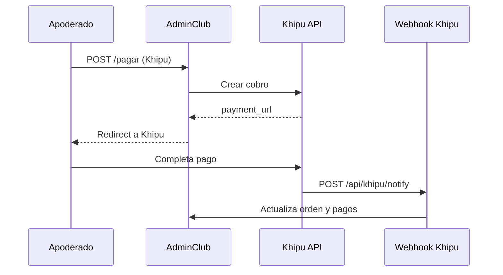

# AdminClub

Aplicación web **Spring Boot** para la administración de clubes deportivos: usuarios por club, categorías, deportistas, cuotas, pagos (efectivo y **Khipu**), panel financiero y notificaciones por correo.

---

## Contenido

1. [Arquitectura (diagrama)](#arquitectura)
2. [Módulos del sistema](#módulos-del-sistema)
3. [Stack tecnológico](#stack-tecnológico)
4. [Requisitos](#requisitos)
5. [Ejecución](#ejecución)
6. [Configuración](#configuración)
7. [Roles y seguridad](#roles-y-seguridad)
8. [Tests y cobertura](#tests-y-cobertura)

---

## Arquitectura

### Vista en capas (lógica de la aplicación)



### Despliegue lógico



### Flujo de pago con Khipu (simplificado)



---

## Módulos del sistema

Estructura bajo el paquete raíz `com.app`:

| Paquete / área | Responsabilidad |
|----------------|-----------------|
| **`com.app`** | Punto de entrada `AdminClubApplication`, configuración global MVC (`MvcConfig`), seguridad web (`SpringSecurityConfig`). |
| **`com.app.controllers`** | Controladores MVC (Thymeleaf): login, club, admin, categorías, cuenta bancaria, financiero, pagos, perfil. `KhipuCallbackController` expone el webhook REST para notificaciones de pago. |
| **`com.app.service`** | Lógica de negocio: usuarios, club, deportistas, categorías, pagos, órdenes Khipu, dashboard, estado de morosidad, exportación financiera, integración con Khipu, correo (`EmailServiceImp`, `AsyncEmailService`). Interfaces `I*` + implementaciones `*Impl`. |
| **`com.app.repository`** | Repositorios Spring Data JPA sobre entidades (usuarios, club, deportistas, pagos, órdenes, categorías, bancos, etc.). |
| **`com.app.entity`** | Modelo de dominio JPA: `Club`, `Usuario`, `Deportista`, `Categoria`, `Pago`, `OrdenPago`, `CuentaBancaria`, `Banco`, `Role`, historial, comprobantes. |
| **`com.app.dto`** | Objetos de transferencia para vistas, reportes y payloads de integración (dashboard, morosidad, Khipu, formularios). |
| **`com.app.enums`** | Enumeraciones de dominio (`EstadoPago`, `MedioPago`). |
| **`com.app.auth`** | `LoginSuccessHandler` y `LoginFailureHandler` para redirección y mensajes tras el login. |
| **`com.app.khipu`** | Verificación de firma HMAC del webhook según documentación Khipu (`KhipuWebhookSignatureVerifier`). |
| **`com.app.config`** | Configuración de ejecución asíncrona (`AsyncConfig`). |
| **`com.app.editors`** | `PropertyEditor` para formularios (p. ej. selección de banco). |
| **`com.app.helper`** | Utilidades de apoyo a integraciones (p. ej. Khipu). |
| **`com.app.util`** | Utilidades generales (`Util`, `AfterCommitRunner`). |
| **`src/main/resources/templates`** | Vistas Thymeleaf y plantillas de correo en `templates/email/`. |
| **`src/test`** | Tests unitarios, de integración MVC/JPA y perfil `application-test.properties` (H2). |

---

## Stack tecnológico

- **Java 17**, **Maven**
- **Spring Boot 3.5.x**: Web (MVC), Thymeleaf (+ extras Spring Security 6), Data JPA, Validation, Security, Mail
- **MySQL** (conector oficial)
- **Lombok**
- Integración de pagos: **Khipu** (API REST + webhook con firma)
- **OpenPDF** y **Apache POI** para exportación PDF/XLSX en el módulo financiero

---

## Requisitos

- JDK 17+
- Maven 3.8+ (o usar el wrapper `./mvnw` incluido)
- MySQL accesible con una base de datos creada (nombre configurable por URL JDBC)

---

## Ejecución

```bash
./mvnw spring-boot:run
```

Por defecto la aplicación usa el puerto **8081** (ver `server.port` en `application.properties`).

Compilar y ejecutar tests:

```bash
./mvnw test
```

Informe de cobertura (JaCoCo) tras `verify`:

```bash
./mvnw verify
# Informe: target/site/jacoco/index.html
```

---

## Configuración

Los parámetros principales están en `src/main/resources/application.properties`.

| Propósito | Propiedades / notas |
|-----------|---------------------|
| Base de datos | `spring.datasource.*`, `spring.jpa.hibernate.ddl-auto` (en **producción** usar `validate`/`none` y migraciones, no `create-drop`). |
| URL pública | `app.public.url` — base para enlaces en correos y callbacks Khipu (`return_url`, `cancel_url`, `notify_url`). |
| Correo | `spring.mail.*`, `mail.set.from` |
| Khipu | `khipu.api.url`, `khipu.api.key`, `khipu.merchant.secret` (HMAC webhook), `khipu.webhook.verify-signature` |
| Subida de archivos | `spring.servlet.multipart.*` |

**Recomendación:** en producción definir credenciales y secretos mediante **variables de entorno** o un gestor de secretos; no versionar contraseñas reales en el repositorio.

---

## Roles y seguridad

- **`ROLE_ADMIN`**: administración global de clubes y usuarios tipo club.
- **`ROLE_CLUB`**: gestión del club (deportistas, categorías, pagos del club, financiero, cuenta bancaria, logo).
- **`ROLE_USER`**: apoderado — consulta de cuotas, pagos y perfil asociados a su club en sesión.

La sesión puede incluir `idClubSession` cuando un mismo email participa en varios clubes. Varios endpoints están protegidos con `@Secured` y reglas de negocio que validan pertenencia a club/usuario donde aplica.

El webhook **`POST /api/khipu/notify`** está exento de CSRF y debe validar la firma `x-khipu-signature` cuando `khipu.webhook.verify-signature=true`.

---

## Tests y cobertura

- Perfil **`test`**: base H2 en memoria (`src/test/resources/application-test.properties`).
- Tests: verificación HMAC, controlador de webhook, seguridad en rutas de pagos, repositorios, servicio de usuarios para Spring Security, etc.

---

## Licencia

Apache License 2.0 (según `pom.xml`).
