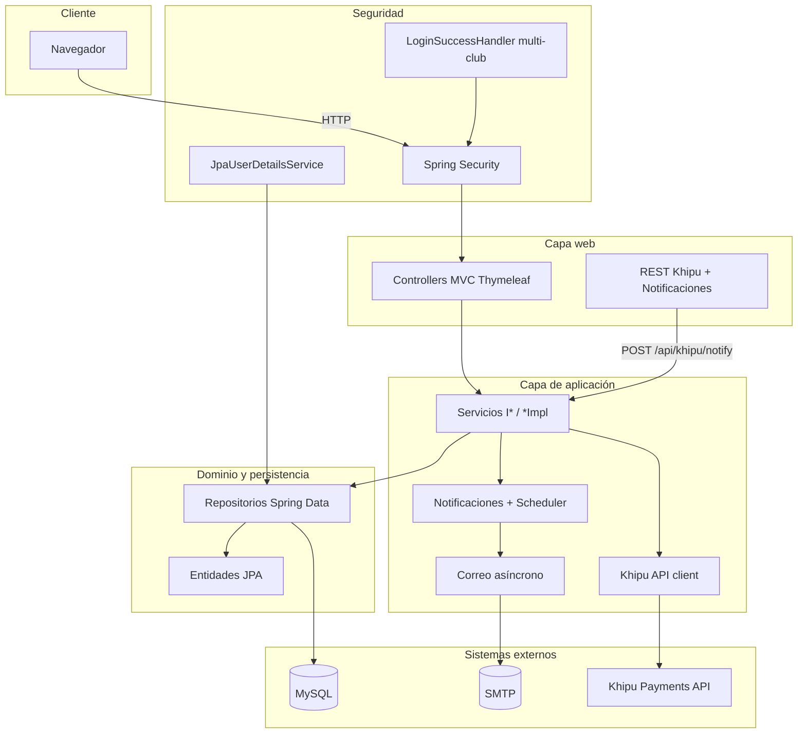
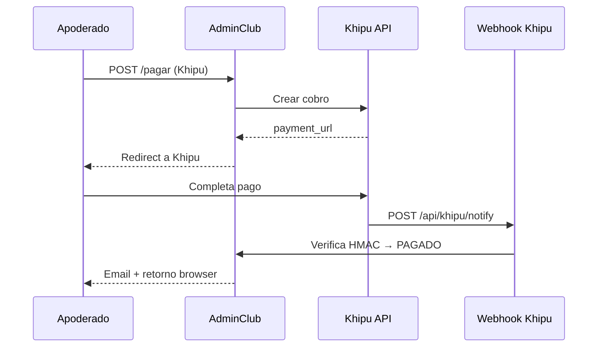

# AdminClub (MiClub)

Aplicación web **Spring Boot** para la administración de clubes deportivos. Plataforma **multi-club** con cuotas mensuales, pagos (efectivo, transferencia y **Khipu**), panel financiero, cobros adicionales, meses sin cobro, control de asistencia, notificaciones automáticas y correo masivo.

---

## Contenido

1. [Funcionalidades](#funcionalidades)
2. [Arquitectura](#arquitectura)
3. [Módulos del sistema](#módulos-del-sistema)
4. [Stack tecnológico](#stack-tecnológico)
5. [Requisitos y ejecución](#requisitos-y-ejecución)
6. [Base de datos y seed](#base-de-datos-y-seed)
7. [Configuración](#configuración)
8. [Roles y seguridad](#roles-y-seguridad)
9. [Tests y cobertura](#tests-y-cobertura)
10. [Documentación adicional](#documentación-adicional)

---

## Funcionalidades

### Plataforma y multi-club
- Un mismo **email** puede pertenecer a varios clubes (`UNIQUE email + id_club`).
- Tras el login, selector de club si el usuario tiene más de uno activo.
- Panel **ROLE_ADMIN** para crear y administrar clubes a nivel plataforma.
- Modo soporte opcional para que el admin entre a un club en solo lectura parcial.

### Gestión del club
- **Deportistas** y **categorías** con valor de cuota.
- **Vigencia histórica** de cuotas por mes/año (ej. enero 2026 distinto a diciembre 2025).
- **Usuarios del club**: apoderados (`ROLE_USER`), tesoreros (`ROLE_TESORERO`), entrenadores (`ROLE_ENTRENADOR`).
- Perfil del club (datos, logo) y cuenta bancaria para transferencias.
- Configuración **Khipu** por club (API key, merchant secret).

### Pagos y cuotas
- Consulta de cuotas pendientes para apoderados (`/consulta`).
- Medios de pago: **efectivo** (aprobación manual), **transferencia** (comprobante adjunto), **Khipu** (pago online).
- Aprobación / rechazo de pagos pendientes por club o tesorero.
- **Cobros adicionales**: matrícula, implementación u otros; por deportista, categoría o club completo.
- **Meses sin cobro (No Pago)**: excluir períodos de generación de cuota, morosidad y notificaciones (alcance club, categoría o deportista).
- Dashboard de pagos, morosidad acumulada y estado por mes.

### Financiero
- Panel financiero con resumen de ingresos y morosidad.
- Exportación **PDF** (OpenPDF) y **Excel** (Apache POI).
- Conciliación con órdenes Khipu.

### Comunicaciones
- Recordatorios automáticos **antes** y **después** del vencimiento de cuota (scheduler configurable).
- Aviso al club por **pago recibido** (activable/desactivable).
- **Correo masivo** con filtros: todos, por categoría, personalizado o morosos del período.
- API REST interna para configuración y envíos (`/api/notifications/*`).

### Asistencia
- Registro diario de asistencia a clases (entrenador / staff).
- Estadísticas de asistencia para el club o solo los deportistas del apoderado.

### Correo
- Plantillas HTML Thymeleaf (creación de usuario, recuperación de clave, recordatorio de cuota, estado de pago, etc.).
- Envío **asíncrono** post-commit para no bloquear las peticiones HTTP.

---

## Arquitectura

### Vista en capas



### Flujo de pago con Khipu



---

## Módulos del sistema

Estructura bajo el paquete raíz `com.app`:

| Paquete / área | Responsabilidad |
|----------------|-----------------|
| **`com.app`** | `AdminClubApplication` (`@EnableAsync`, `@EnableScheduling`), `SpringSecurityConfig`, `MvcConfig`. |
| **`com.app.controllers`** | MVC: login, club, admin, categorías, cuentas, financiero, pagos, perfil, cobros adicionales, no-pago, asistencia, notificaciones. |
| **`com.app.service`** | Lógica de negocio: usuarios, club, deportistas, categorías, vigencias de cuota, pagos, Khipu, dashboard, morosidad, financiero, asistencia, no-pago. Interfaces `I*` + `*Impl`. |
| **`com.app.notification`** | Submódulo: config por club, recordatorios programados, correo masivo, REST `/api/notifications`. |
| **`com.app.repository`** | Spring Data JPA sobre todas las entidades. |
| **`com.app.entity`** | `Club`, `Usuario`, `Role`, `Deportista`, `Categoria`, `CategoriaValorVigencia`, `Pago`, `OrdenPago`, `CuentaBancaria`, `NoPagoConfig`, `AsistenciaClase`, etc. |
| **`com.app.dto`** | DTOs y forms para vistas, reportes e integraciones. |
| **`com.app.enums`** | `EstadoPago`, `MedioPago`, `ConceptoPago`. |
| **`com.app.auth`** | Handlers de login (multi-club, redirección por rol). |
| **`com.app.security`** | Constantes `AppRoles`. |
| **`com.app.khipu`** | Verificación HMAC del webhook. |
| **`com.app.config`** | Async (pool de correo), filtro `correlationId` en logs. |
| **`com.app.mail`** | Logo inline en emails. |
| **`com.app.util`** | `AfterCommitRunner` (emails tras commit). |
| **`src/main/resources/templates`** | Vistas Thymeleaf + plantillas en `templates/email/`. |
| **`src/main/resources/db`** | DDL de referencia (`01-schema-adminclub.sql`) y scripts auxiliares. |
| **`src/test`** | Tests unitarios/integración + `ExportImportSqlTool` para regenerar `import.sql`. |

---

## Stack tecnológico

| Tecnología | Uso |
|------------|-----|
| **Java 17** | Lenguaje |
| **Spring Boot 3.5.x** | Web MVC, JPA, Security, Validation, Mail |
| **Thymeleaf** + extras Spring Security 6 | Vistas server-side |
| **MySQL 8** | Base de datos |
| **Bootstrap 5.2**, Font Awesome 5, jQuery 3.3, SweetAlert2 | Frontend |
| **Khipu** | Pagos online (REST + webhook HMAC) |
| **OpenPDF** | Export PDF financiero |
| **Apache POI** | Export Excel financiero |
| **Lombok** | Reducción de boilerplate |
| **JaCoCo** | Cobertura de tests |

---

## Requisitos y ejecución

### Requisitos

- JDK 17+
- Maven 3.8+ (o wrapper `./mvnw`)
- MySQL 8+ con base **`bd_adm_club_desa`** (local) o **`bd_adm_club_pro`** / **`bd_adm_club_desa`** en VPS (MySQL compartido `mysql-server`)

### Arrancar la aplicación

```bash
./mvnw spring-boot:run
```

Puerto por defecto: **8081** → [http://localhost:8081](http://localhost:8081)

### Compilar y tests

```bash
./mvnw test
./mvnw verify   # incluye informe JaCoCo → target/site/jacoco/index.html
```

---

## Base de datos y seed

En desarrollo se usa `spring.jpa.hibernate.ddl-auto=create-drop` y el archivo **`src/main/resources/import.sql`** como seed inicial (club demo, admin, categorías, deportistas, etc.).

DDL de referencia (solo estructura): **`src/main/resources/db/scriptFinal.sql`**.

### Regenerar `import.sql` desde la BD actual

```bash
./mvnw test-compile exec:java \
  -Dexec.mainClass=com.app.tools.ExportImportSqlTool \
  -Dexec.classpathScope=test
```

Variables opcionales: `SPRING_DATASOURCE_URL`, `SPRING_DATASOURCE_USERNAME`, `SPRING_DATASOURCE_PASSWORD`.

> **Producción:** usar `ddl-auto=validate` o `none` y migraciones versionadas (Flyway/Liquibase). No usar `create-drop`.

---

## Configuración

Parámetros en `src/main/resources/application.properties`:

| Propósito | Propiedades |
|-----------|-------------|
| Base de datos | `spring.datasource.*`, `spring.jpa.hibernate.ddl-auto` |
| URL pública | `app.public.url` — enlaces en correos y callbacks Khipu |
| Correo | `spring.mail.*`, `mail.set.from` — **por ahora SMTP IRCD** (`mail.ircd.cl`, `test@ircd.cl`); ver `.env.example` |
| Khipu | Credenciales por club en cuenta bancaria; fallback global `khipu.merchant.secret`. Webhook: `khipu.webhook.verify-signature` |
| Notificaciones | `notifications.scheduler.enabled`, `notifications.scheduler.cron` (default: 08:00 diario) |
| Admin soporte | `admin.soporte.enabled` |
| Archivos | `spring.servlet.multipart.*` (comprobantes transferencia, max 5 MB en lógica de negocio) |

**Recomendación:** en producción definir credenciales mediante **variables de entorno** o gestor de secretos; no versionar contraseñas reales.

---

## Roles y seguridad

| Rol | Alcance principal |
|-----|-------------------|
| **`ROLE_ADMIN`** | Plataforma: CRUD clubes, incidencias de pagos, modo soporte |
| **`ROLE_CLUB`** | Administración completa del club |
| **`ROLE_TESORERO`** | Finanzas, pagos, comunicaciones (similar a CLUB en operaciones financieras) |
| **`ROLE_ENTRENADOR`** | Deportistas y asistencia. **Sin** pagos, finanzas, cuentas ni correos masivos |
| **`ROLE_USER` / `ROLE_SOCIO`** | Apoderado: consulta/pago de cuotas, perfil, asistencia de sus deportistas |

### Sesión HTTP

| Atributo | Descripción |
|----------|-------------|
| `idClubSession` | Club activo (contexto multi-tenant) |
| `usuarioLogin` | Usuario del club en sesión |
| `usuariosClub` | Lista para selector cuando hay varios clubes |
| `adminSoporte` | Modo soporte admin (solo lectura parcial) |

### Rutas destacadas

| Ruta | Roles | Descripción |
|------|-------|-------------|
| `/consulta` | USER, SOCIO | Cuotas y pagos apoderado |
| `/listadoPagos` | CLUB, TESORERO | Gestión pagos del club |
| `/financiero` | CLUB, TESORERO | Panel financiero |
| `/cobros-adicionales` | CLUB, TESORERO | Cobros extra |
| `/no-pago` | CLUB, TESORERO | Meses sin cobro |
| `/notificaciones/*` | CLUB, TESORERO | Comunicaciones |
| `/asistencia/*` | Staff + apoderado | Registro y estadísticas |
| `/listadoClub`, `/admin/*` | ADMIN | Panel plataforma |
| `POST /api/khipu/notify` | Público (CSRF off) | Webhook Khipu con firma HMAC |

Autenticación: form login con `email` + `password` (BCrypt). Autorización: `@Secured` en controllers.

---

## Tests y cobertura

- Perfil **test**: H2 en memoria (`src/test/resources/application-test.properties`).
- Cobertura de: webhook Khipu (HMAC), seguridad en pagos, repositorios, `JpaUserDetailsService`, utilidades.
- Herramienta de exportación: `com.app.tools.ExportImportSqlTool`.

```bash
./mvnw verify
# Informe: target/site/jacoco/index.html
```

---

## Despliegue en VPS (Docker)

### Qué faltaba (y ya está en el repo)

| Elemento | Estado |
|----------|--------|
| `Dockerfile` multi-stage (build + JRE) | ✅ Añadido |
| `docker-compose.yml` (app DESA, sin MySQL) | ✅ Añadido |
| `docker-compose.prod.yml` (app PROD, sin MySQL) | ✅ Añadido |
| `deploy/docker-compose-mysql.yml` (MySQL compartido `mysql-server`) | ✅ Añadido |
| `.github/workflows/deploy.yml` (CI/CD) | ✅ Añadido |
| Perfil `application-prod.properties` | ✅ Añadido |
| `.env.example` (secretos fuera del código) | ✅ Añadido |
| `.dockerignore` | ✅ Añadido |

### Antes de subir: cambios críticos respecto a desarrollo

1. **`ddl-auto=create-drop`** (dev) borra la BD en cada reinicio → en prod usar **`validate`** (ya configurado en perfil `prod`).
2. **`app.public.url`** debe ser **`https://adminclub.cl`** (correos y callbacks Khipu).
3. **Credenciales** de BD y correo solo por variables de entorno (`.env`), no en `application.properties`.
4. **Khipu webhook** debe apuntar a `https://adminclub.cl/api/khipu/notify` (HTTPS obligatorio).
5. **Reverse proxy** (Nginx/Caddy) delante del contenedor para SSL; la app expone solo `127.0.0.1:8080`.

### Pasos en el VPS (primera vez)

```bash
# 1. Clonar en /opt/adminclub (ruta usada por el workflow CI/CD)
sudo mkdir -p /opt/adminclub
sudo chown $USER:$USER /opt/adminclub
git clone <tu-repo> /opt/adminclub && cd /opt/adminclub

# 2. Configurar entorno
cp .env.example .env
nano .env   # DOCKER_IMAGE=tuusuario/adminclub:latest, BD, SMTP IRCD, Khipu

# 3. Levantar (MySQL inicializa esquema + import.sql la primera vez)
docker compose -f docker-compose.prod.yml up -d

# 4. Ver logs
docker compose -f docker-compose.prod.yml logs -f app
```

### CI/CD con GitHub Actions (multi-ambiente)

| Rama | Imagen Docker Hub | VPS |
|------|-------------------|-----|
| `desa` | `{usuario}/mi-club:desa` | `/root/admin-club/desa` (SSH puerto **5416**) |
| `prod` | `{usuario}/mi-club:prod` | `/root/admin-club/prod` (SSH puerto **5416**) |

**Secrets en GitHub** (Settings → Secrets and variables → Actions):

| Secret | Descripción |
|--------|-------------|
| `DOCKERHUB_USERNAME` | Usuario Docker Hub |
| `DOCKERHUB_TOKEN` | Access token Docker Hub |
| `VPS_HOST` | Host/IP del servidor DESA |
| `VPS_USER` | Usuario SSH DESA |
| `VPS_SSH_KEY` | Clave privada SSH DESA |
| `VPS_HOST_PROD` | Host/IP del servidor PROD |
| `VPS_USER_PROD` | Usuario SSH PROD |
| `VPS_SSH_KEY_PROD` | Clave privada SSH PROD |

Workflow: [`.github/workflows/deploy.yml`](.github/workflows/deploy.yml)

**Primera vez en el VPS** (plantillas en `deploy/`):

```bash
# 1. MySQL compartido (una sola vez)
bash deploy/setup-vps.sh mysql
cd /root/admin-club/mysql && docker compose up -d
# Crea: bd_adm_club_pro y bd_adm_club_desa

# 2. PROD (solo app)
bash deploy/setup-vps.sh prod
nano /root/admin-club/prod/.env
cd /root/admin-club/prod && docker compose up -d

# 3. DESA (solo app)
bash deploy/setup-vps.sh desa
nano /root/admin-club/desa/.env
cd /root/admin-club/desa && docker compose up -d

# Migración desde 2 contenedores MySQL antiguos:
bash deploy/migrate-shared-mysql.sh
```

Cada push a `desa` o `main` construye la imagen y actualiza solo el contenedor de la app (`app-club-desa` / `app-club-prod`).

### Nginx (ejemplo mínimo)

```nginx
server {
    listen 443 ssl http2;
    server_name adminclub.cl www.adminclub.cl;

    ssl_certificate     /etc/letsencrypt/live/adminclub.cl/fullchain.pem;
    ssl_certificate_key /etc/letsencrypt/live/adminclub.cl/privkey.pem;

    location / {
        proxy_pass http://127.0.0.1:8080;
        proxy_set_header Host $host;
        proxy_set_header X-Real-IP $remote_addr;
        proxy_set_header X-Forwarded-Proto $scheme;
        proxy_set_header X-Forwarded-For $proxy_add_x_forwarded_for;
    }
}

# Redirigir HTTP → HTTPS
server {
    listen 80;
    server_name adminclub.cl www.adminclub.cl;
    return 301 https://adminclub.cl$request_uri;
}
```

Certificado gratuito:

```bash
certbot --nginx -d adminclub.cl -d www.adminclub.cl
```

### Checklist post-despliegue

- [ ] Login admin y club de prueba
- [ ] `APP_PUBLIC_URL=https://adminclub.cl` en `.env`
- [ ] SMTP IRCD configurado (`mail.ircd.cl`, `test@ircd.cl`, contraseña en `SPRING_MAIL_PASSWORD`)
- [ ] Webhook Khipu: `https://adminclub.cl/api/khipu/notify`
- [ ] Scheduler de notificaciones (cron 08:00 Chile)
- [ ] Backup periódico del volumen `mysql_data`

### Sin Docker (alternativa)

Puedes ejecutar el JAR directamente en el VPS:

```bash
./mvnw -DskipTests package
java -jar target/admin-club-v1.jar --spring.profiles.active=prod
```

MySQL instalado en el host; variables de entorno según `.env.example`.

---

## Documentación adicional

- **[MASTER_PROMPT.md](MASTER_PROMPT.md)** — Especificación técnica completa para replicar la aplicación desde cero (entidades, flujos, convenciones, fases de implementación).

---

## Licencia

Apache License 2.0 (según `pom.xml`). 
